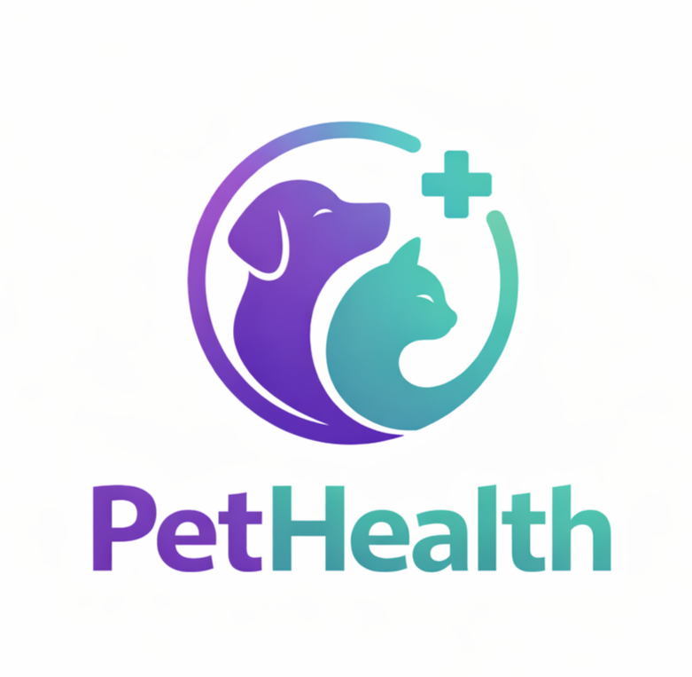

 

# Universidad Peruana de Ciencias Aplicadas
### Facultad de Ingeniería · Ciclo 2026-10

 

# 📄 Informe de Proyecto - Avance 1

## Presentado por ´Six Seven Team´

## 🚀 Startup: PetHealt

*Sistema de gestión de clínicas veterinarias*

 

**Código del Curso:** 1ASI0730 &nbsp;|&nbsp; **Nombre del Curso:** Aplicaciones Web

**NRC:** `10203`

**Profesor:** Alex Humberto Sánchez Ponce

 

### Integrantes de ´Six Seven Team´

`U20410239` - `Salinas Guzmán, Brianna Cristina` 

`U20XXXXXXX` - `Apellido1 Apellido2, Nombre2` 

`U20XXXXXXX` - `Apellido1 Apellido2, Nombre3` 

`U20XXXXXXX` - `Apellido1 Apellido2, Nombre4` 

`U20XXXXXXX` - `Apellido1 Apellido2, Nombre5` 

### **Abril 2026**

---

 

  
## 📋 Registro de Versiones del Informe

| Versión | Fecha | Participantes | Descripción de modificación |
|:-------:|:-----:|:-----:|:---------------------------|
| AV1 | 2026-04-08 | Salinas Guzmán, Brianna Cristina  Nombre 2  Nombre 3  Nombre 4  Nombre 5 | Avance 1 del reporte del proyecto y primera versión de la landing page |
| | | | |

---

 

## 🔗 Project Report Collaboration Insights

**URL del Repositorio:** [`https://github.com/SixSeven-Team/PetHealth-project-report-AV1.git`](https://github.com/SixSeven-Team/PetHealth-project-report-AV1.git)

*(Esta sección se irá expandiendo con cada entrega)*

---

 

## 📑 Tabla de Contenidos
  #### [Contenido](#-tabla-de-contenidos)
  #### [Student Outcome](#-student-outcome)

  #### [Capítulo I: Introducción](./pethealt-report/docs/capitulo-1.md)
  - [1.1. Startup Profile](./pethealt-report/docs/capitulo-1.md#11-startup-profile)
    - [1.1.1. Descripción de la Startup](./pethealt-report/docs/capitulo-1.md#111-descripción-de-la-startup)
    - [1.1.2. Perfiles de integrantes del equipo](./pethealt-report/docs/capitulo-1.md#112-perfiles-de-integrantes-del-equipo)
  - [1.2. Solution Profile](./pethealt-report/docs/capitulo-1.md#12-solution-profile)
    - [1.2.1. Antecedentes y problemática](./pethealt-report/docs/capitulo-1.md#121-antecedentes-y-problemática)
    - [1.2.2. Lean UX Process](./pethealt-report/docs/capitulo-1.md#122-lean-ux-process)
      - [1.2.2.1. Lean UX Problem Statements](./pethealt-report/docs/capitulo-1.md#1221-lean-ux-problem-statements)
      - [1.2.2.2. Lean UX Assumptions](./pethealt-report/docs/capitulo-1.md#1222-lean-ux-assumptions)
      - [1.2.2.3. Lean UX Hypothesis Statements](./pethealt-report/docs/capitulo-1.md#1223-lean-ux-hypothesis-statements)
      - [1.2.2.4. Lean UX Canvas](./pethealt-report/docs/capitulo-1.md#1224-lean-ux-canvas)
  - [1.3. Segmentos objetivo](./pethealt-report/docs/capitulo-1.md#13-segmentos-objetivo)
 
  #### [Capítulo II: Requirements Elicitation & Analysis](./brandradar-report/docs/capitulo-2.md)
  - [2.1. Competidores](./pethealt-report/docs/capitulo-2.md#21-competidores)
    - [2.1.1. Análisis competitivo](./pethealt-report/docs/capitulo-2.md#211-análisis-competitivo)
    - [2.1.2. Estrategias y tácticas frente a competidores](./pethealt-report/docs/capitulo-2.md#212-estrategias-y-tácticas-frente-a-competidores)
  - [2.2. Entrevistas](./pethealt-report/docs/capitulo-2.md#22-entrevistas)
    - [2.2.1. Diseño de entrevistas](./pethealt-report/docs/capitulo-2.md#221-diseño-de-entrevistas)
    - [2.2.2. Registro de entrevistas](./pethealt-report/docs/capitulo-2.md#222-registro-de-entrevistas)
    - [2.2.3. Análisis de entrevistas](./pethealt-report/docs/capitulo-2.md#223-análisis-de-entrevistas)
  - [2.3. Needfinding](./pethealt-report/docs/capitulo-2.md#23-needfinding)
    - [2.3.1. User Personas](./pethealt-report/docs/capitulo-2.md#231-user-personas)
    - [2.3.2. User Task Matrix](./pethealt-report/docs/capitulo-2.md#232-user-task-matrix)
    - [2.3.3. User Journey Mapping](./pethealt-report/docs/capitulo-2.md#233-user-journey-mapping)
    - [2.3.4. Empathy Mapping](./pethealt-report/docs/capitulo-2.md#234-empathy-mapping)
  - [2.4. Big Picture Event Storming](./pethealt-report/docs/capitulo-2.md#24-big-picture-event-storming)
  - [2.5. Ubiquitous Language](./pethealt-report/docs/capitulo-2.md#25-ubiquitous-language)
    
  #### [Capítulo III: Requirements Specification](./brandradar-report/docs/capitulo-3.md)
  - [3.1. User Stories](./pethealt-report/docs/capitulo-3.md#31-user-stories)
  - [3.2. Impact Mapping](./pethealt-report/docs/capitulo-3.md#32-impact-mapping)
  - [3.3. Product Backlog](./pethealt-report/docs/capitulo-3.md#33-product-backlog)
    
  #### [Capítulo IV: Product Design](./brandradar-report/docs/capitulo-4.md)
  - [4.1. Style Guidelines](./pethealt-report/docs/capitulo-4.md#41-style-guidelines)
    - [4.1.1. General Style Guidelines](./pethealt-report/docs/capitulo-4.md#411-general-style-guidelines)
    - [4.1.2. Web Style Guidelines](./pethealt-report/docs/capitulo-4.md#412-web-style-guidelines)
  - [4.2. Information Architecture](./pethealt-report/docs/capitulo-4.md#42-information-architecture)
    - [4.2.1. Organization Systems](./pethealt-report/docs/capitulo-4.md#421-organization-systems)
    - [4.2.2. Labeling Systems](./pethealt-report/docs/capitulo-4.md#422-labeling-systems)
    - [4.2.3. SEO Tags and Meta Tags](./pethealt-report/docs/capitulo-4.md#423-seo-tags-and-meta-tags)
    - [4.2.4. Searching Systems](./pethealt-report/docs/capitulo-4.md#424-searching-systems)
    - [4.2.5. Navigation Systems](./pethealt-report/docs/capitulo-4.md#425-navigation-systems)
  - [4.3. Landing Page UI Design](./pethealt-report/docs/capitulo-4.md#43-landing-page-ui-design)
    - [4.3.1. Landing Page Wireframe](./pethealt-report/docs/capitulo-4.md#431-landing-page-wireframe)
    - [4.3.2. Landing Page Mock-up](./pethealt-report/docs/capitulo-4.md#432-landing-page-mock-up)
  - [4.4. Web Applications UX/UI Design](./pethealt-report/docs/capitulo-4.md#44-web-applications-uxui-design)
    - [4.4.1. Web Applications Wireframes](./pethealt-report/docs/capitulo-4.md#441-web-applications-wireframes)
    - [4.4.2. Web Applications Wireflow Diagrams](./pethealt-report/docs/capitulo-4.md#442-web-applications-wireflow-diagrams)
    - [4.4.3. Web Applications Mock-ups](./pethealt-report/docs/capitulo-4.md#443-web-applications-mock-ups)
    - [4.4.4. Web Applications User Flow Diagrams](./pethealt-report/docs/capitulo-4.md#444-web-applications-user-flow-diagrams)
  - [4.5. Web Applications Prototyping](./pethealt-report/docs/capitulo-4.md#45-web-applications-prototyping)
  - [4.6. Domain-Driven Software Architecture](./pethealt-report/docs/capitulo-4.md#46-domain-driven-software-architecture)
    - [4.6.1. Design-Level Event Storming](./pethealt-report/docs/capitulo-4.md#461-design-level-event-storming)
    - [4.6.2. Software Architecture Context Diagram](./pethealt-report/docs/capitulo-4.md#462-software-architecture-context-diagram)
    - [4.6.3. Software Architecture Container Diagrams](./pethealt-report/docs/capitulo-4.md#463-software-architecture-container-diagrams)
    - [4.6.4. Software Architecture Components Diagrams](./pethealt-report/docs/capitulo-4.md#464-software-architecture-components-diagrams)
  - [4.7. Software Object-Oriented Design](./pethealt-report/docs/capitulo-4.md#47-software-object-oriented-design)
    - [4.7.1. Class Diagrams](./pethealt-report/docs/capitulo-4.md#471-class-diagrams)
  - [4.8. Database Design](./pethealt-report/docs/capitulo-4.md#48-database-design)
    - [4.8.1. Database Diagrams](./pethealt-report/docs/capitulo-4.md#481-database-diagrams)
      
  #### [Capítulo V: Product Implementation, Validation & Deployment](./pethealt-report/docs/capitulo-5.md)
  - [5.1. Software Configuration Management](./pethealt-report/docs/capitulo-5.md#51-software-configuration-management)
    - [5.1.1. Software Development Environment Configuration](./pethealt-report/docs/capitulo-5.md#511-software-development-environment-configuration)
    - [5.1.2. Source Code Management](./pethealt-report/docs/capitulo-5.md#512-source-code-management)
    - [5.1.3. Source Code Style Guide & Conventions](./pethealt-report/docs/capitulo-5.md#513-source-code-style-guide--conventions)
    - [5.1.4. Software Deployment Configuration](./pethealt-report/docs/capitulo-5.md#514-software-deployment-configuration)
  - [5.2. Landing Page, Services & Applications Implementation](./pethealt-report/docs/capitulo-5.md#52-landing-page-services--applications-implementation)
    - [5.2.1. Sprint 1](./pethealt-report/docs/capitulo-5.md#521-sprint-1)
  - [5.3. Validation Interviews](./pethealt-report/docs/capitulo-5.md#53-validation-interviews)
  - [5.4. Video About-the-Product](./pethealt-report/docs/capitulo-5.md#54-video-about-the-product)
    
  #### [Conclusiones](#conclusiones-1)
  
  #### [Recomendaciones](#recomendaciones-1)

  #### [Video About-the-Team](#video-about-the-team-1)
  
  #### [Bibliografía](#-bibliografía)
  
  #### [Anexos](#anexos-1)

---

 

## 🎯 Student Outcome

En el siguiente cuadro se describen las acciones realizadas y enunciados de conclusiones que permiten sustentar el logro alcanzado.

| Criterio específico | Acciones realizadas | Conclusiones |
|:---|:---|:---|
| **5.c1. Trabaja en equipo para proporcionar liderazgo en forma conjunta.** | **Salinas Brianna**   AV1: (acción específica)    **[Apellido, Nombre 2]**   AV1: (acción específica)    **[Apellido, Nombre 3]**   AV1: (acción específica)    **[Apellido, Nombre 4]**   AV1: (acción específica)    **[Apellido, Nombre 5]**   AV1: (acción específica) | (Completar de forma grupal en cada entrega) |
| **5.c2. Crea un entorno colaborativo e inclusivo, establece metas, planifica tareas y cumple objetivos** | **Salinas Brianna**   AV1: (acción específica)    **[Apellido, Nombre 2]**   AV1: (acción específica)    **[Apellido, Nombre 3]**   AV1: (acción específica)    **[Apellido, Nombre 4]**   AV1: (acción específica)    **[Apellido, Nombre 5]**   AV1: (acción específica) | (Completar de forma grupal en cada entrega) |

---

 

## Conclusiones

*(Esta sección se desarrolla progresivamente en cada entrega)*

## Recomendaciones

*(Esta sección se desarrolla progresivamente en cada entrega)*

## Video About-The-Team

*(Incluir screenshot, URL de Microsoft Stream y YouTube, y timing del video)*

---

 

## 📚 Bibliografía

*(Listar referencias en formato APA)*

---

 

## Anexos

### Anexo A: Participant Performance Report

*(Adjuntar como documento Word y PDF por separado)*

### Anexo B: Videos de Exposiciones

| Entrega | Título | Enlace |
|:-------:|:------:|:------:|
| AV1 | `upc-pre-202610-1asi0729-[10203]-[pethealt]-expo-av1` | `[URL Microsoft Stream]` |

---

 

*PetHealt · Aplicaciones Web · UPC 2026-10*

